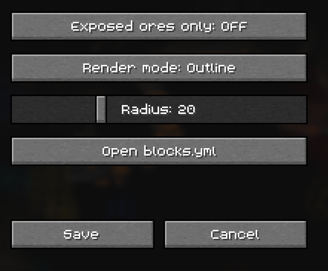
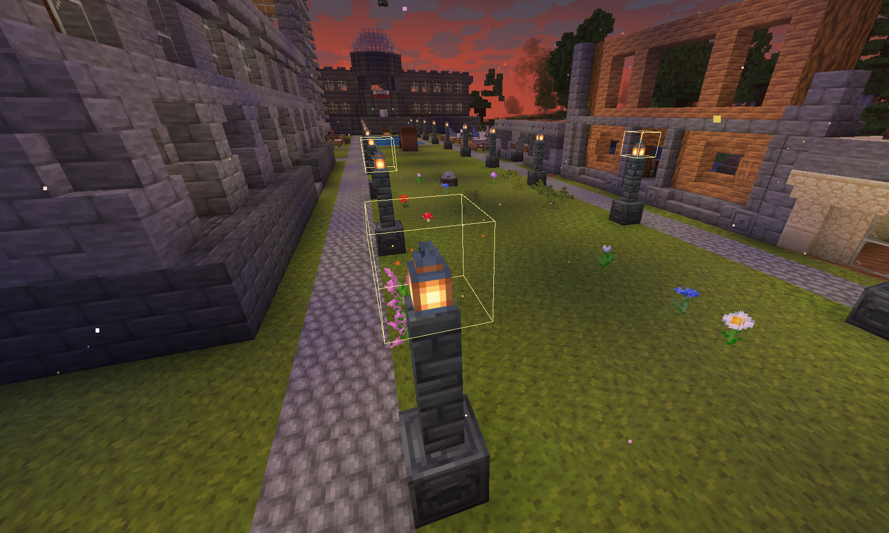

# Watdad

Ultimate tool to catch x-rayers by using legal x-ray.

## Features

| What?                         | How?                                            | Description                                                                                      |
|-------------------------------|-------------------------------------------------|--------------------------------------------------------------------------------------------------|
| Legal xray                    | Enable spectator mode                           | See what xrayers see, locked behind spectator mode, so staff can't abuse it.                     |
| Instant coreprotect lookup    | `/xray <level>`                                 | Instant coreprotect lookup command for tracing xrayers in deepslate or stone level (gold mining).|

## Customizing your own highlighted blocks

### Intro

You were probably thinking: damn, what if `diamond_ore` had a different color or chests were highlighted. Well, since `v1.2.0` you can!

### How to do it

In the mod menu, there is a button to open up `blocks.yml`. This will lead you to a yaml file where you can define blocks and a hex color.



You can list any block, as long as it exists.\

**Tip:** You don't need to rejoin or restart the game to apply changes to the custom blocks.

**WARNING: I do not recommend listing a common block, like stone, deepslate, dirt, ... as this can cause a big fps drop, lag or even crash your game.**



## Changelog

### v1.0.0 Basic functionality

Targets versions: `v1.21.4`-`v1.21.8`

- General code added.

### v1.1.0 Moderation addon

Targets versions: `v1.21.4`-`v1.21.8`

- Added `/xray`.

### v1.2.0 Rework mod

Targets versions: `v1.21.9`-`v1.21.11`

- Expanded `/xray` with `ancient_debris` and `nether_quartz_ore` option.
- Made highlighted blocks fully customizable via a `blocks.yml` file.
- Added `full` render mode for full boxes instead of outlines.
- Removed keybinding to show unexposed ores.
- Removed CoreProtect highlighter.
- Gave the mod menu a new look.
- Reworked the backend code.

## Builds

### 26.1.2 and below

```shell
.\gradlew.bat clean build
```

### 26.2

```shell
.\gradlew.bat clean build '-Pminecraft_version=26.2' '-Pfabric_api_version=0.155.2+26.2' '-Psupported_minecraft_versions_override=>=26.2 <26.3'
```